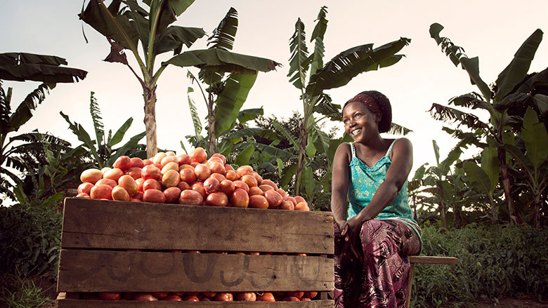
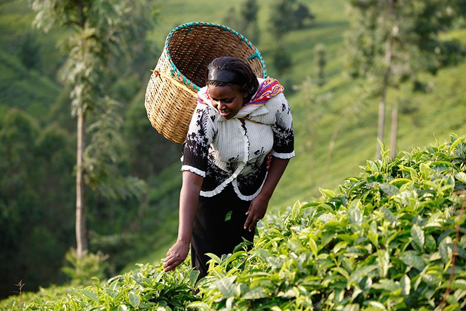
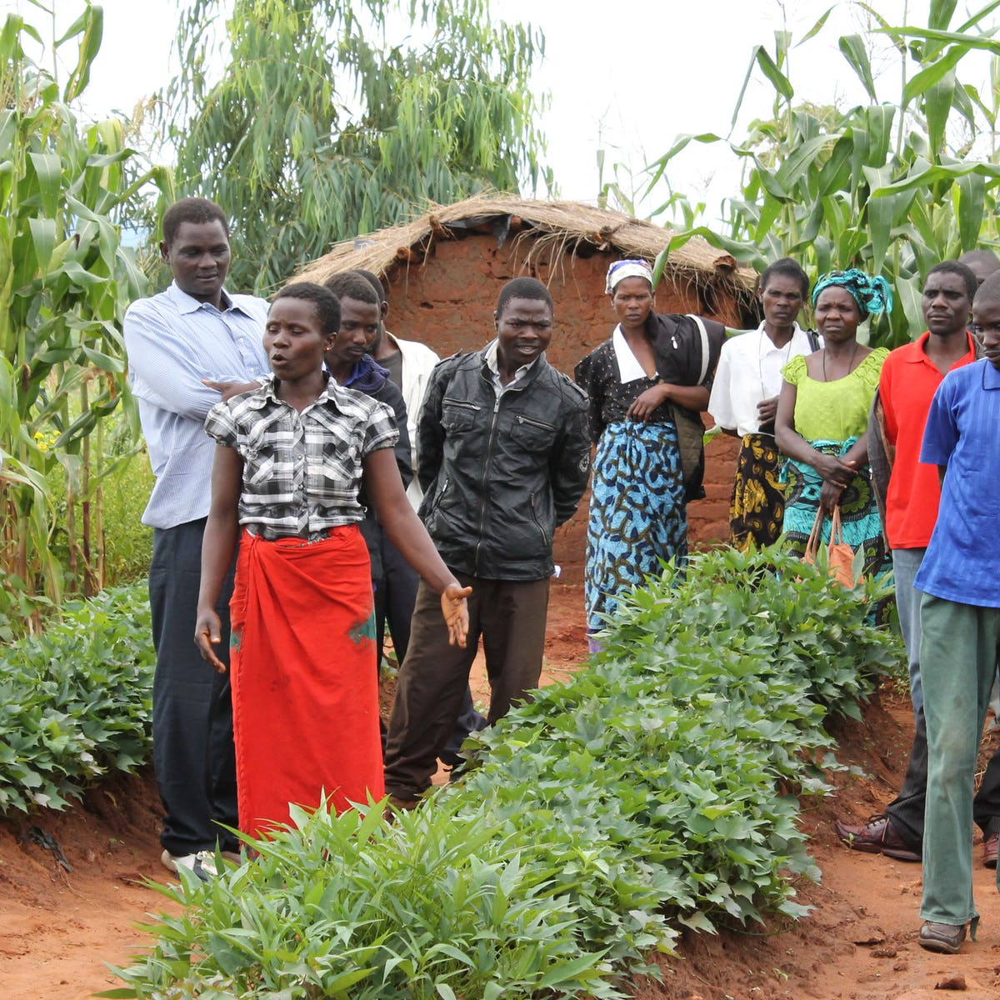
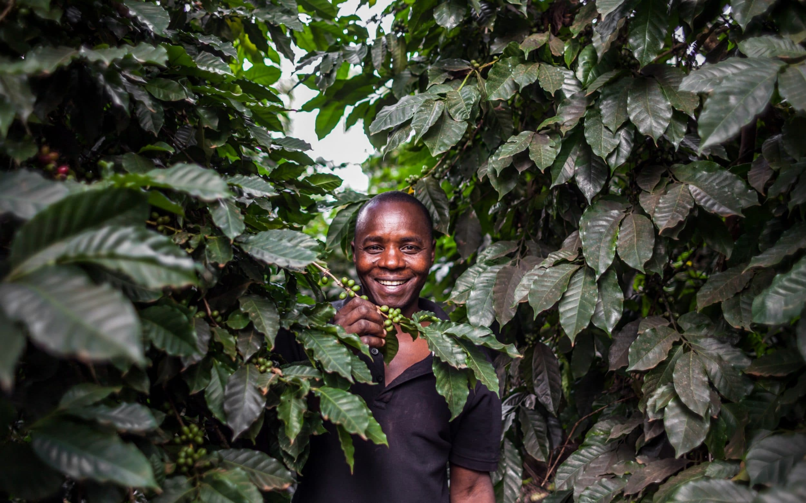

```{r setup, include=FALSE}
knitr::opts_chunk$set(echo = TRUE)
```


## Hayley Schroeder https://github.com/hayleyadair
<br>

## Leah Nandudu https://github.com/Nandudu-dotcom

.png)


---
---
<style type="text/css">

h1.title {
  font-size: 38px;
  color: Green;
  text-align: center;
}
h4.author { 
  font-size: 18px;
  font-family: "Times New Roman", Times, serif;
  color: DarkRed;
  text-align: center;
}
h4.date {
  font-size: 18px;
  font-family: "Times New Roman", Times, serif;
  color: DarkBlue;
  text-align: center;
}
</style>


```{r setdir, echo = FALSE}
#setwd("/Users/ln242/Documents/Fall_classes_2020/NTRES_DATA_SCIENCE/Git_class_folder/Assigment2")
```


<br /> <center>
<h1> AGRI-WORLD AFRICA </h1>
<br /> <br /> <br />


<br /> <center>
 <h3> Africa's biggest agricultural technology and credit provider </h3>
 <br />
 <h3>Putting women's needs first in the agricultural value chain</h3> </center>





<br />
<h3> Agriculture holds the potential to develop Africa since 80% of the population formally work in the sector. Despite its potential Agriculture is underdeveloped mainly due to the lack of access to proper inputs and credit services. <h3>

<br />
<h3>Agricultural policies currently implemented by African countries are weak and do not favor farmers. <h3>



 <br />
<h3>Agric-world Africa is a farmer led organization that is  non-profit.
We advocate for farmers'rights by providing technologies and credit services.
These are high quality services that boost agricultural procuctivity .<h3>

## Field operations
 <br />
<h3>Uganda, Nigeria, South Africa ,Ghana, Kenya, Rwanda among others <h3>

## Head office 
 <br />
    <h3>Plot 111-113 Namatala 
    Mbale central city 
    Uganda , East Africa <h3>
    
  
<br /> <center>
<h3> Services worth every farmers' smile </h3>