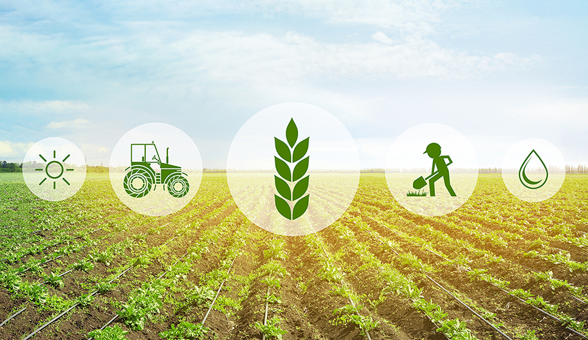

<style type="text/css">

h1.title {
  font-size: 38px;
  color: Green;
  text-align: center;
}
h4.author { 
  font-size: 18px;
  font-family: "Times New Roman", Times, serif;
  color: DarkRed;
  text-align: center;
}
h4.date {
  font-size: 18px;
  font-family: "Times New Roman", Times, serif;
  color: DarkBlue;
  text-align: center;
}
</style>

```{r setup, include= TRUE}
knitr::opts_chunk$set(echo = FALSE)
```

```{r setdir, echo = FALSE}
setwd("/Users/ln242/Desktop/des")
```

<br /> <br /> <br />
